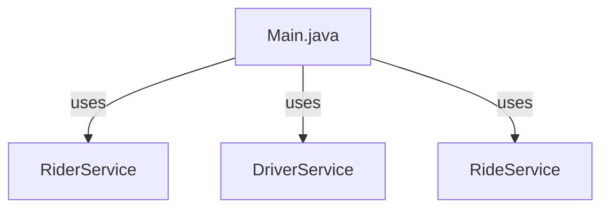
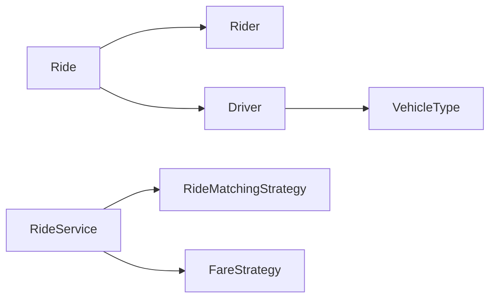

# RideWise - Class Model & Architecture
## System Architecture

## Core Domain Classes
**Rider** - id, name, location
**Driver** - id, name, locationX/Y, vehicleType, available, completedRides
**Ride** - id, rider, driver, distance, status, fareReceipt
**FareReceipt** - rideId, amount, generatedAt
**VehicleType**: BIKE, AUTO, CAR
**RideStatus**: REQUESTED, ASSIGNED, COMPLETED, CANCELLED
## Service Layer
- **RiderService**: Manages riders (register, retrieve, list)
- **DriverService**: Manages drivers (register, retrieve, availability)
- **RideService**: Orchestrates ride lifecycle with strategies
## Strategy Pattern
**RideMatchingStrategy** 
- NearestDriverStrategy
- LeastActiveDriverStrategy
**FareStrategy**
- DefaultFareStrategy (10 + distance × 5)
- PeakHourFareStrategy (1.5× multiplier 18:00-23:00)
## Utilities
- **IdGenerator**: Generates unique IDs (thread-safe)
- **OfflineGeocoder**: Maps localities to coordinates
## Class Relationships

## Design Patterns
- Strategy Pattern: Flexible matching and fare algorithms
- Service Layer: Business logic separation
- Factory: ID generation
